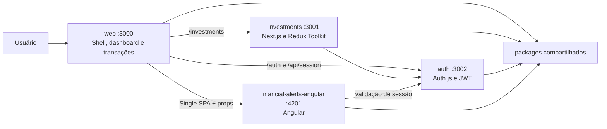

# Sistema de Gerenciamento Financeiro

Aplicação de gerenciamento financeiro desenvolvida para o **Tech Challenge - Fase 2** da Pós-graduação FIAP. O projeto evolui a solução criada na Fase 1 para um monorepo com microfrontends em **Next.js/React** e **Angular**, autenticação centralizada, dashboards financeiros, gestão de transações e investimentos, conteinerização e preparação para deploy na Vercel.

- Repositório: [github.com/MariaLemos/y](https://github.com/MariaLemos/y)
- Protótipo: [Figma - Projeto Financeiro](https://www.figma.com/design/ns5TC3X5Xr8V7I3LYKg9KA/Projeto-Financeiro?node-id=503-4264&t=gZy56WDAUfXtS23Y-1)
- Vídeo demonstrativo: **link ainda não informado no repositório**
- Aplicação em cloud: **URL pública ainda não informada no repositório**

## Requisitos do Tech Challenge - Fase 2

Legenda: ✅ implementado; 🟡 implementado parcialmente ou preparado; ⬜ não evidenciado no repositório.

| Requisito do enunciado                            | Como o projeto atende                                                                                                                                                                                                                                                                          | Status |
| ------------------------------------------------- | ---------------------------------------------------------------------------------------------------------------------------------------------------------------------------------------------------------------------------------------------------------------------------------------------- | :----: |
| Gráficos e análises financeiras na Home           | Gráfico de receitas x despesas, gráfico de despesas por categoria, saldo, extrato, métricas de investimentos, alocação da carteira e progresso das metas.                                                                                                                                      |   ✅   |
| Personalização do dashboard com widgets           | Metas e alertas existem como áreas do dashboard, mas o usuário ainda não pode escolher, ordenar ou ocultar widgets. Este item é um **plus e não compõe a nota**, conforme o enunciado.                                                                                                         |   🟡   |
| Filtros avançados e pesquisa de transações        | Pesquisa por descrição e filtros por tipo e categoria, com ação para limpar os filtros.                                                                                                                                                                                                        |   ✅   |
| Paginação ou scroll infinito                      | A listagem filtrada é paginada em grupos de cinco transações, com controles de página anterior e próxima.                                                                                                                                                                                      |   ✅   |
| Validação avançada ao adicionar/editar transações | Validação contínua de descrição, categoria, valor, tipo e data com React Hook Form. O valor deve ser positivo e limitado a R$ 1.000.000; datas futuras ou anteriores a um ano são rejeitadas.                                                                                                  |   ✅   |
| Sugestão automática de categorias                 | Sugestões baseadas no tipo e em palavras-chave da descrição, como mercado, transporte, salário, aluguel e condomínio.                                                                                                                                                                          |   ✅   |
| Anexos em transações                              | O formulário aceita imagens e PDFs, exibe os metadados e permite remover o anexo. Como não há backend, somente nome, tamanho e MIME type são persistidos; o conteúdo do arquivo não é enviado.                                                                                                 |   🟡   |
| Containerização de frontend e componentes         | As quatro aplicações possuem Dockerfile próprio.                                                                                                                                                                                                                                               |   ✅   |
| Docker Compose ou Kubernetes                      | `docker-compose.yml` orquestra `web`, `auth`, `investments` e `financial-alerts-angular`.                                                                                                                                                                                                      |   ✅   |
| Deploy em ambiente cloud                          | Há configuração de Vercel Microfrontends para as apps Next.js e `vercel.json` para o Angular. A URL pública da entrega ainda precisa ser adicionada.                                                                                                                                           |   🟡   |
| Autenticação e autorização                        | SSO por credenciais com Auth.js, sessão JWT, cookies protegidos, middlewares de rota, validação de sessão no Angular, hash bcrypt, limite de tentativas e redirects/origens permitidos. O controle de acesso atual diferencia usuário autenticado de não autenticado; não há perfis ou papéis. |   ✅   |
| Microfrontends independentes                      | Shell e transações em `web`, área de investimentos em uma app Next.js independente e alertas em Angular.                                                                                                                                                                                       |   ✅   |
| Integração por Single SPA ou Module Federation    | O Angular é montado no shell como parcel do Single SPA; as apps Next.js usam `@vercel/microfrontends`, roteamento entre aplicações e rewrites.                                                                                                                                                 |   ✅   |
| Roteamento e comunicação entre microfrontends     | `/investments` é encaminhado para a app de investimentos; locale e dados de autenticação são enviados ao Angular por props; contratos, traduções e UI são compartilhados por packages.                                                                                                         |   ✅   |
| Gestão de estado complexa                         | Redux Toolkit/React Redux gerencia metas, investimentos e aportes. Transações usam Context + `useReducer`.                                                                                                                                                                                     |   ✅   |
| TypeScript                                        | Apps e packages são tipados e possuem tarefa de typecheck.                                                                                                                                                                                                                                     |   ✅   |
| SSR ou SSG                                        | Os layouts Next.js usam Server Components para cookies, tema, idioma, sessão e metadados. A estratégia adotada é SSR; SSG não é usado nas áreas autenticadas.                                                                                                                                  |   ✅   |
| UX e acessibilidade                               | Layout responsivo, navegação desktop/mobile, temas claro/escuro, português/inglês, feedback de erro/carregamento, HTML semântico, ARIA e modais com foco controlado, Escape e focus trap.                                                                                                      |   ✅   |
| README com instruções de desenvolvimento          | Instalação, configuração, execução, URLs, comandos e limitações estão documentados abaixo.                                                                                                                                                                                                     |   ✅   |
| Vídeo demonstrativo                               | Deve mostrar funcionalidades, integração dos microfrontends, deploy cloud e melhorias do frontend. O link ainda precisa ser incluído nesta página.                                                                                                                                             |   ⬜   |

## Funcionalidades

### Dashboard financeiro

- boas-vindas e saldo calculado a partir das transações;
- extrato das transações mais recentes;
- atalho para iniciar uma nova transação;
- gráfico comparativo de receitas e despesas;
- gráfico de despesas agrupadas por categoria;
- alertas financeiros fornecidos pelo microfrontend Angular;
- tema claro/escuro e interface em português ou inglês.

### Transações

- criação, edição e exclusão com confirmação;
- depósito, transferência e retirada;
- descrição, categoria, valor e data;
- validação em tempo real;
- sugestão automática de categoria;
- seleção de anexo em imagem ou PDF;
- busca por descrição e filtros por tipo/categoria;
- paginação da lista;
- rotas dedicadas e modais interceptados pelo App Router.

### Investimentos e metas

- dashboard com valor planejado, valor atual e progresso geral;
- cadastro, edição e exclusão de metas;
- cadastro e edição de investimentos;
- associação de investimentos a metas;
- registro de aportes;
- alocação por classe de ativo e investimentos não associados;
- estado global com Redux Toolkit e persistência local.

### Alertas financeiros

- microfrontend desenvolvido em Angular;
- montagem e desmontagem pelo ciclo de vida do Single SPA;
- filtros de alertas lidos e não lidos;
- marcação de alerta como lido;
- validação da sessão central antes da exibição;
- fallback no shell caso os bundles remotos estejam indisponíveis.

### Autenticação unificada (SSO)

- autoridade central em `apps/auth` com Auth.js/NextAuth.js;
- login por credenciais e sessão JWT;
- cookie de sessão compartilhável entre as aplicações;
- logout central e retorno para a origem solicitante;
- rotas de `web` e `investments` protegidas por middleware;
- verificação da sessão pelo microfrontend Angular;
- senhas comparadas com hash bcrypt;
- cookie `httpOnly`, `sameSite=lax` e `secure` em produção;
- rate limit de login por IP e e-mail;
- allowlist de origens para redirects e CORS.

## Arquitetura



O shell público fica em `http://localhost:3000`. A navegação para `/investments` cruza a fronteira entre as apps Next.js e faz carregamento completo da nova zone. Os alertas Angular são carregados dinamicamente no dashboard e montados como um parcel do Single SPA.

### Estrutura do monorepo

```text
apps/
  auth/                       # autoridade central de autenticação (Next.js)
  web/                        # shell, Home e transações (Next.js)
  investments/                # microfrontend de investimentos (Next.js + Redux)
  financial-alerts-angular/   # microfrontend de alertas (Angular + Single SPA)

packages/
  auth/                       # configuração e utilitários compartilhados de autenticação
  contracts/                  # contratos de transações, metas, investimentos e aportes
  design-system/              # UI, tema, gráficos, hooks e Storybook
  i18n/                       # catálogos e providers pt-BR/en-US
  utils/                      # moeda, datas, saldo e agrupamentos
  eslint-config/              # configurações compartilhadas do ESLint
  typescript-config/          # configurações compartilhadas do TypeScript
```

### Apps e responsabilidades

| Workspace                  | Responsabilidade                                                                           | Porta local |
| -------------------------- | ------------------------------------------------------------------------------------------ | :---------: |
| `web`                      | Shell principal, dashboard, CRUD e listagem de transações, gráficos e montagem do Angular. |    3000     |
| `investments`              | Metas, carteira, aportes, métricas e estado Redux.                                         |    3001     |
| `auth`                     | Login, logout, emissão/validação de sessão e endpoint central `/api/session`.              |    3002     |
| `financial-alerts-angular` | Alertas financeiros integrados ao shell pelo Single SPA.                                   |    4201     |

### Packages compartilhados

- `@repo/design-system`: atoms, molecules e organisms reutilizáveis, gráficos Recharts, tokens, temas, navegação, modais e hooks;
- `@repo/contracts`: tipos e contratos que evitam acoplamento direto entre apps;
- `@repo/auth`: configuração de credenciais/JWT e clientes para consultar a sessão central;
- `@repo/i18n`: traduções e troca de locale compartilhadas entre React e Angular;
- `@repo/utils`: funções puras para moeda, datas, saldo e agrupamento de transações;
- `@repo/eslint-config` e `@repo/typescript-config`: padronização de qualidade e compilação.

Uma app não deve importar código diretamente de outra app. Recursos comuns devem ser movidos para `packages/*` ou expostos por um contrato bem definido.

## Tecnologias

- Next.js 16 e React 19;
- Angular 18;
- TypeScript;
- Single SPA e `single-spa-angular`;
- Vercel Microfrontends;
- Redux Toolkit e React Redux;
- Auth.js/NextAuth.js e bcrypt;
- React Hook Form;
- Recharts;
- Tailwind CSS;
- Turborepo e Yarn Workspaces;
- Storybook;
- Docker, Docker Compose e Nginx;
- ESLint e Prettier.

## Como executar em desenvolvimento

### Pré-requisitos

- Node.js 18 ou superior; Node.js 22 é a versão usada nas imagens Docker;
- Yarn Classic 1.22;
- Git;
- Docker e Docker Compose, somente para a execução conteinerizada.

### 1. Clonar e instalar

```sh
git clone https://github.com/MariaLemos/y.git
cd y
yarn install --frozen-lockfile
```

O gerenciador definido pelo projeto é o Yarn e o `yarn.lock` deve ser tratado como lockfile principal.

### 2. Configurar o ambiente

As apps Next.js carregam arquivos de ambiente a partir do próprio workspace. Copie o exemplo para `auth`, `web` e `investments`:

macOS/Linux:

```sh
cp .env.example apps/auth/.env.local
cp .env.example apps/web/.env.local
cp .env.example apps/investments/.env.local
```

PowerShell:

```powershell
Copy-Item .env.example apps/auth/.env.local
Copy-Item .env.example apps/web/.env.local
Copy-Item .env.example apps/investments/.env.local
```

Defina pelo menos um segredo longo em `AUTH_SECRET`. Para configurar o usuário mock fora do fallback de desenvolvimento, gere um hash bcrypt - nunca armazene a senha em texto puro:

```sh
node -e "console.log(require('bcryptjs').hashSync('sua-senha', 10))"
```

Use o resultado em `AUTH_MOCK_USER_PASSWORD_HASH` e preencha `AUTH_MOCK_USER_EMAIL` e `AUTH_MOCK_USER_NAME`.

Variáveis principais:

| Variável                                                                      | Finalidade                                                  |
| ----------------------------------------------------------------------------- | ----------------------------------------------------------- |
| `AUTH_SECRET`                                                                 | Assinatura da sessão JWT; obrigatória em produção.          |
| `AUTH_MOCK_USERS_JSON`                                                        | Lista opcional de usuários mock com hashes bcrypt.          |
| `AUTH_MOCK_USER_EMAIL`, `AUTH_MOCK_USER_NAME`, `AUTH_MOCK_USER_PASSWORD_HASH` | Alternativa para configurar um único usuário mock.          |
| `AUTH_COOKIE_DOMAIN`, `AUTH_COOKIE_NAME`                                      | Compartilhamento e nome do cookie de sessão.                |
| `AUTH_ALLOWED_ORIGINS`                                                        | Origens autorizadas para redirects e integração entre apps. |
| `AUTH_RATE_LIMIT_WINDOW_MINUTES`, `AUTH_RATE_LIMIT_MAX_ATTEMPTS`              | Janela e limite de tentativas de login.                     |
| `NEXT_PUBLIC_APP_ORIGIN`                                                      | Origem pública do shell.                                    |
| `NEXT_PUBLIC_AUTH_ORIGIN`                                                     | Origem pública da autoridade de autenticação.               |
| `NEXT_PUBLIC_INVESTMENTS_ORIGIN`, `INVESTMENTS_ORIGIN`                        | Origens pública e interna da app de investimentos.          |
| `NEXT_PUBLIC_FINANCIAL_ALERTS_ORIGIN`                                         | Origem dos bundles do microfrontend Angular.                |
| `INVESTMENTS_ASSET_PREFIX`                                                    | Prefixo dos assets da zone de investimentos.                |

### 3. Iniciar todas as aplicações

```sh
yarn dev:web
```

O Turborepo inicia `auth`, `web`, `investments` e `financial-alerts-angular` em paralelo. Depois, acesse:

- Home: [http://localhost:3000](http://localhost:3000)
- Transações: [http://localhost:3000/transactions](http://localhost:3000/transactions)
- Investimentos pelo shell: [http://localhost:3000/investments](http://localhost:3000/investments)
- App de investimentos direta: [http://localhost:3001/investments](http://localhost:3001/investments)
- Login central: [http://localhost:3002/login](http://localhost:3002/login)
- Microfrontend Angular: [http://localhost:4201](http://localhost:4201)

Quando nenhuma credencial foi configurada e `NODE_ENV` não é `production`, existem dois usuários exclusivamente para desenvolvimento:

| E-mail                   | Senha      |
| ------------------------ | ---------- |
| `mariaj.lemos@yahoo.com` | `290596`   |
| `fiap@teste.com`         | `fiap 123` |

### Execução individual

```sh
yarn dev:auth
yarn dev:investments
yarn dev:financial-alerts
```

Para iniciar somente o shell, use `yarn workspace web dev`. Alguns recursos ficarão indisponíveis se autenticação, investimentos ou alertas não estiverem ativos.

## Docker e orquestração

Cada aplicação possui build multi-stage. A imagem Angular usa Nginx para servir os bundles e configurar os headers necessários ao carregamento pelo shell.

> **Atenção:** o Compose já descreve a orquestração exigida pelo desafio, mas a configuração atual não encaminha `AUTH_SECRET` e os usuários mock para o build/runtime dos serviços Next.js. Antes de uma execução conteinerizada completa, configure essa injeção por secrets/variáveis da plataforma ou por um override local não versionado.

Depois de disponibilizar as variáveis aos serviços, inicie a stack:

```sh
docker compose up --build
```

Serviços do Compose:

| Serviço                    | Container | Porta exposta |
| -------------------------- | --------- | :-----------: |
| `web`                      | Next.js   |     3000      |
| `investments`              | Next.js   |     3001      |
| `auth`                     | Next.js   |     3002      |
| `financial-alerts-angular` | Nginx     |     4201      |

Em produção, injete `AUTH_SECRET` e os usuários mock no serviço `auth`; use o mesmo segredo e nome de cookie nos serviços Next.js que validam o JWT. O segredo também precisa estar disponível durante o build atual, pois o Next.js avalia a configuração de autenticação ao coletar as rotas. Ajuste as origens públicas para os domínios reais. O arquivo `.env` usado pelo Compose para interpolação não substitui a configuração segura de secrets da plataforma de deploy.

Para encerrar:

```sh
docker compose down
```

## Comandos úteis

```sh
# Desenvolvimento de todos os workspaces que possuem tarefa dev
yarn dev

# Build completo
yarn build

# Build por aplicação
yarn build:web
yarn build:auth
yarn build:investments
yarn build:financial-alerts

# Qualidade
yarn lint
yarn check-types
yarn format
```

Tarefas também podem ser filtradas diretamente pelo Turborepo:

```sh
yarn turbo build --filter=web
yarn turbo build --filter=investments
yarn turbo lint --filter=@repo/design-system
```

## Storybook e design system

O Storybook documenta componentes reutilizáveis fora das aplicações:

```sh
yarn workspace @repo/design-system storybook
```

Acesse [http://localhost:6006](http://localhost:6006).

O design system inclui, entre outros:

- atoms: `Button`, `Input`, `Select`, `Switch`, `Typography` e `ThemeToggle`;
- molecules: `BarChart`, `PieChart`, `ProgressBar`, `DialogModal`, `InputWrapper`, `List`, `SectionBox`, `Navigation`, `MobileNavigation`, `LanguageSelector`, `UserMenu` e `SensitiveDataBox`;
- organism: `Header`;
- hooks/providers: tema, modal e detecção de viewport;
- tokens de cores e temas claro/escuro.

Componentes compartilhados devem ser documentados com stories que cubram variações, estados de erro, vazio, carregamento e responsividade.

## UX, acessibilidade e internacionalização

- navegação responsiva para desktop e mobile;
- foco inicial, restauração de foco, focus trap e fechamento com `Escape` nos modais;
- labels associados aos campos e mensagens com `role="alert"`/`role="status"`;
- estados ARIA em botões, filtros, barras de progresso e áreas carregadas dinamicamente;
- ações de ícone com nomes acessíveis;
- temas com tokens de contraste e alternância persistida;
- catálogos em português e inglês compartilhados por React e Angular;
- navegação por teclado usando controles HTML nativos e links.

## Dados, persistência e limitações atuais

O enunciado informa que o backend seria disponibilizado separadamente. Neste repositório, a interface continua independente de uma API real:

- transações começam com dados mockados e são persistidas no `localStorage`;
- metas, investimentos e aportes usam Redux Toolkit com persistência no `localStorage`;
- alertas usam dados em memória no microfrontend Angular;
- usuários são mockados por variáveis de ambiente;
- anexos persistem somente metadados, não o arquivo;
- ao limpar os dados do navegador, o estado volta aos mocks iniciais;
- o rate limit atual fica em memória e deve ser substituído por uma solução distribuída em produção;
- não há autorização baseada em papéis;
- não há suíte de testes automatizados configurada no momento.

## Evolução desde a Fase 1

A primeira fase entregou a base da experiência financeira:

- saldo da conta corrente;
- extrato e histórico de transações;
- criação, edição e exclusão com confirmação;
- dados mockados e estado local;
- TypeScript, Next.js, Turborepo e design system;
- sistema de tema e modais reutilizáveis;
- Storybook para componentes compartilhados.

Na Fase 2, a base foi ampliada com gráficos, busca/filtros, paginação, validação e anexos, autenticação central, investimentos com Redux, integração React/Angular por microfrontends, internacionalização, acessibilidade, Docker Compose e configuração para cloud.

## Monorepo e Turborepo

Os workspaces são definidos na raiz:

```json
{
  "workspaces": ["apps/*", "packages/*"]
}
```

O `turbo.json` padroniza e ordena `build`, `dev`, `lint`, `check-types`, `storybook` e `build-storybook`. O cache local evita repetir tarefas quando entradas e dependências não mudaram.

Para habilitar cache remoto do Turborepo:

```sh
turbo login
turbo link
```

## Referências

- [Next.js](https://nextjs.org/docs)
- [Vercel Microfrontends](https://vercel.com/docs/microfrontends)
- [Single SPA](https://single-spa.js.org/)
- [Angular](https://angular.dev/)
- [React](https://react.dev/)
- [Redux Toolkit](https://redux-toolkit.js.org/)
- [Auth.js](https://authjs.dev/)
- [TypeScript](https://www.typescriptlang.org/docs/)
- [Tailwind CSS](https://tailwindcss.com/docs)
- [Turborepo](https://turborepo.com/docs)
- [Yarn Workspaces](https://classic.yarnpkg.com/lang/en/docs/workspaces/)
- [Storybook](https://storybook.js.org/docs)
- [React Hook Form](https://react-hook-form.com/get-started)
- [Docker Compose](https://docs.docker.com/compose/)

---

Desenvolvido como parte do Tech Challenge da Pós-graduação FIAP.
